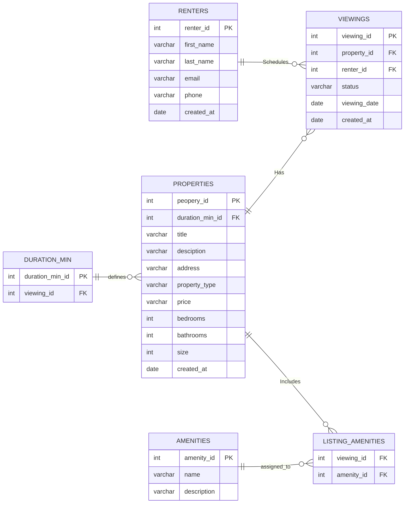

# Rental Marketplace Database

Name: Akram Helil

The Rental Marketplace domain enables renters to discover rental properties, view available amenities, and schedule property viewings. The system manages property listings, their amenities, and rental duration constraints.

## The domain

Represents individuals who use the marketplace to browse properties and schedule viewings.

### 1. Renters

Represents individuals who use the marketplace to browse properties and schedule viewings.

#### Responsibility

- Store renter profile information.
- Schedule and manage property viewings.
- Browse properties and amenities.

#### Attributes

| Attribute | Type | Description |
| ------------ | ------ | ------------- |
| renter_id | int | Unique identifier for the renter |
| first_name | varchar | Renter's first name |
| last_name | varchar | Renter's last name |
| email | varchar | Renter's email address |
| phone | varchar | Renter's contact number |
| created_at | date | Date the renter account was created |

#### Relationships

- A renter can have many viewings.
- A viewing belongs to one renter.

#### Business Rules

- A renter can schedule multiple property viewings.
- Each renter should have a unique email address.

### 2. Properties

Represents rental properties available in the marketplace.

#### Responsibilities

- Store property listing information.
- Associate amenities with a property.
- Define minimum rental duration requirements.

#### Attributes

| Attribute | Type | Description |
| ------------ | ------ | ------------- |
| peopery_id | int | Unique property identifier |
| duration_min_id | int | Associated duration requirement |
| title | varchar | Property listing title |
| desciption | varchar | Detailed property description |
| address | varchar | Property address |
| property_type | varchar | Type of property (Apartment, House, Condo, etc.) |
| price | varchar | Rental price |
| bedrooms | int | Number of bedrooms |
| bathrooms | int | Number of bathrooms |
| size | int | Property size |
| created_at | date | Date the property was created |

#### Relationships

- A property can have many viewings.
- A property can have many amenities.
- A property belongs to one duration rule.

#### Business Rules

- Every property must reference a valid minimum duration.
- A property may have multiple amenities.
- A property may have multiple viewings.

## 3. Viewings

Represents scheduled appointments for renters to visit properties.

#### Responsibilities

- Schedule property inspections.
- Track viewing status.

#### Attributes

| Attribute | Type | Description |
| ------------ | ------ | ------------- |
| viewing_id | int | Unique viewing identifier |
| property_id | int | Associated property |
| renter_id | int | Associated renter |
| status | varchar | Viewing status |
| viewing_date | date | Scheduled viewing date |
| created_at | date | Date the viewing record was created |

#### Relationships

- Belongs to one renter.
- Belongs to one property.

### Business Rules

- Every viewing must be linked to one renter.
- Every viewing must be linked to one property.
- Viewings can be scheduled, completed, or canceled.

## 4. Amenities

Represents features or services available at a property.
Examples: WiFi, Parking, Pool, Gym, Air Conditioning

#### Attributes

| Attribute | Type | Description |
| ------------ | ------ | ------------- |
| amenity_id | int | Unique amenity identifier |
| name | varchar | Amenity name |
| description | varchar | Description of the amenity |

#### Relationships

An amenity can be associated with many properties.

## 5. Listing_Amenities

Associative entity that resolves the many-to-many relationship between properties and amenities.

#### Responsibilities

Link properties to amenities.

#### Attributes

| Attribute | Type | Description |
| ------------ | ------ | ------------- |
| viewing_id | int | Foreign key reference |
| amenity_id | int | Foreign key reference |
| property_id | int | Foreign key reference |

#### Relationships

- References an amenity.
- References a listing.

### Business Rules

- Prevent duplicate amenity assignments.
- Supports many-to-many relationships between listings and amenities.

## 6. Duration_Min

Defines the minimum rental duration allowed for a property.

#### Responsibilities

Enforce rental duration requirements.

#### Attributes

| Attribute | Type | Description |
| ------------ | ------ | ------------- |
| duration_min_id | int | Unique duration identifier |
| viewing_id | int | Related reference identifier |

#### Relationships

- A duration rule can apply to multiple properties.
- A property must references one duration rule.

### Business Rules

- Properties must reference a valid duration requirement.
- Duration requirements determine minimum rental eligibility.

## Relationship Summary

```text
RENTERS (1) -------- (M) VIEWINGS
 
PROPERTIES (1) ----- (M) VIEWINGS
 
PROPERTIES (1) ----- (M) LISTING_AMENITIES
 
AMENITIES (1) ------ (M) LISTING_AMENITIES
 
DURATION_MIN (1) --- (M) PROPERTIES
```

## Schema

## ER Diagram



---
